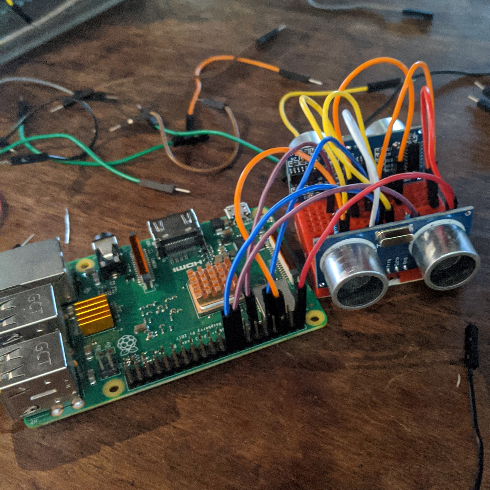

# double_sensor_theremin
My attempt on a rpi-3 based theremin with pitch control and modulation

 

I've used [Raspberry Org's Ultrasonic Theremin](https://projects.raspberrypi.org/en/projects/ultrasonic-theremin) as a base to this project, only modifying the wiring to make it work with 2 sensors instead of one. Minor changes were made to the code as well.

With python-osc, I get the information coming through the raspberry pi's ultrasonic sensors and send it to Sonic Pi. The raspberry pi is connected via ssh to my main computer, for that makes for a more portable setup, in case I need it for a presentation.
